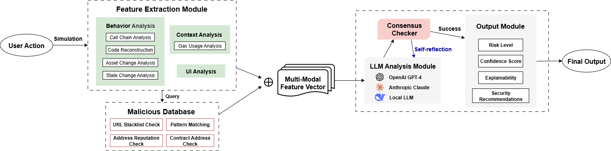

# DeepTx

Comprehensive EVM-based blockchain transaction analyzer with multi-model LLM analysis and consensus mechanisms.

> *AI-Powered Transaction Guard - Decode, Detect, Defend Against Fraud & Phishing in Real-Time.*

## Architecture



*Comprehensive security analysis flow from user action to final risk assessment*

## Two Core Capabilities

### 1️⃣ Historical Transaction Analysis
Analyze past on-chain transactions to detect malicious behavior.

### 2️⃣ Pre-Transaction Simulation
Simulate transactions before execution to predict outcomes and risks.

---

## Features

- **Transaction Analysis** - Call trace, contract fetching, function extraction
- **Security Assessment** - 30K+ malicious addresses, 320K+ phishing domains
- **Multi-Model AI** - GPT-4o-mini, GPT-3.5-turbo, GPT-4o with consensus
- **UI Phishing Detection** - JavaScript security pattern analysis
- **Comprehensive Reports** - Risk level, confidence score, recommendations

## Quick Start

```bash
# 1. Install Heimdall
curl https://sh.rustup.rs -sSf | sh
curl -L http://get.heimdall.rs | bash
bifrost

# 2. Install Python dependencies
pip install -r requirements.txt

# 3. Configure API keys
cp env.example .env
# Edit .env with your keys
```

### Required API Keys

```bash
TRANSPOSE_API_KEY=your_key      # Free: 100K req/month
ETHERSCAN_API_KEY=your_key      # Free: 5 req/s
OPENAI_API_KEY=your_key         

# Optional: For simulation mode only
TENDERLY_API_KEY=your_key
TENDERLY_ACCOUNT_ID=your_id
TENDERLY_PROJECT_SLUG=your_project
```

**Get Keys:**
- Transpose: https://docs.transpose.io/quickstart/
- Etherscan: https://etherscan.io/apis
- OpenAI: https://platform.openai.com/api-keys
- Tenderly: https://tenderly.co/ (optional)

## Usage

### Mode 1: Historical Transaction

```bash
python3 main.py 0xff8e9226091d513fc936ecc670030eba03f34dbe60cd012122bd18be44248d32
```

### Mode 2: Simulation

```bash
# Replay existing transaction
python3 main.py -s true --tx-hash 0xabc... --rpc-url https://eth.llamarpc.com

# Simulate contract call
python3 main.py -s true --contract 0xA0b86991c6218b36c1d19D4a2e9Eb0cE3606eB48 \
  --function 'balanceOf(address)' 0x742d35Cc6634C0532925a3b844Bc9e7595f0bEb0

# With sender and value
python3 main.py -s true --contract 0xAddr --function 'deposit()' \
  --from 0xYourAddr --value 0xDE0B6B3A7640000 --block 18000000
```

## Analysis Process

### Historical Mode
```
Transaction Hash → Heimdall Trace → Security Check → Multi-Model LLM → Final Report
```

### Simulation Mode
```
Contract Call → Tenderly Simulation → Security Check → Multi-Model LLM → Final Report
```

## Output Files

Results saved in `output/<chain_id>/<tx_hash>/`:

**Core Files:**
- `decoded_trace.json` - Complete trace
- `call_trace.csv` - Call chain and gas
- `code.txt` - Extracted functions
- `asset_flows.csv` - Token transfers
- `state_changes.csv` - Storage changes
- `address.txt` - Involved addresses

**Analysis Files:**
- `security_report.json` - Security database check
- `security_analysis_*.json` - 3 model reports
- `consensus_final_report.json` - Consensus result
- `final_comprehensive_report.json` - **Final report**

## Analysis Framework

**4-Category Analysis:**
1. **Behavior** - Call patterns, asset movements, state changes
2. **Context** - Gas efficiency, transaction patterns
3. **UI** - JavaScript security, phishing detection
4. **Database** - Malicious addresses, threat intelligence

**Risk Levels:** Safe | Suspicious | Malicious

## Interactive Features

Optional inputs during analysis:
- **URLs** - One per line, Enter twice to finish
- **JavaScript** - Code to analyze, Enter twice to finish

Or pre-create: `url.txt`, `js.txt` in output directory

## Troubleshooting

```bash
# Verify installation
heimdall --version

# Check API keys
cat .env

# Test Tenderly (simulation mode)
curl -H "X-Access-Key: $TENDERLY_API_KEY" \
  https://api.tenderly.co/api/v1/account/$TENDERLY_ACCOUNT_ID/project/$TENDERLY_PROJECT_SLUG
```

## Awards & Publications

**📄 ASE 2025 Tool Demonstration Track**
- **DeepTx: Real-Time Transaction Risk Analysis via Multi-Modal Features and LLM Reasoning**
- [Conference Paper](https://conf.researchr.org/details/ase-2025/ase-2025-tool-demonstration-track/14/DeepTx-Real-Time-Transaction-Risk-Analysis-via-Multi-Modal-Features-and-LLM-Reasonin)
- Demo Video: [YouTube](https://youtu.be/4OfK9KCEXUM)

## Citation

```bibtex
@inproceedings{Liu2025DRT,
  author = {Liu, Yixuan and Li, Xinlei and Li, Yi},
  booktitle = {Proceedings of the 40th IEEE/ACM International Conference on Automated Software Engineering (ASE)},
  month = nov,
  title = {{DeepTx}: Real-Time Transaction Risk Analysis via Multi-Modal Features and {LLM} Reasoning},
  year = {2025}
}
```

## Acknowledgments

This project is an enhanced version of [PyDeepTx](https://github.com/SecurFi/PyDeepTx) by SecurFi. We acknowledge their foundational work and the ETHDenver 2025 ORA Second Prize achievement([Project Page](https://devfolio.co/projects/deeptx-c682)).

## Links
- **ASE 2025 Conference**: https://conf.researchr.org/details/ase-2025/ase-2025-tool-demonstration-track/14/DeepTx-Real-Time-Transaction-Risk-Analysis-via-Multi-Modal-Features-and-LLM-Reasonin
- **Demo Video**: https://youtu.be/4OfK9KCEXUM
